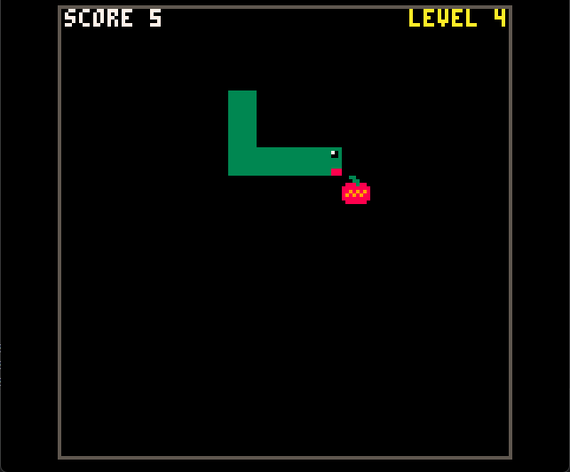

# PicoSnake

A classic Snake clone built with [PICO-8](https://www.lexaloffle.com/pico-8.php).

**[Play online on github pages](https://gaitovrat.github.io/PicoSnake/)**




## Gameplay

- Eat the cherries to grow the snake and earn points.
- The snake speeds up as your score climbs (a square-root curve — fast at first, then leveling off).
- Hit a wall and the game is over.

The HUD shows your current **score** on the left and **level** (1–9) on the right.

## Controls

| Action      | Key            |
|-------------|----------------|
| Move        | Arrow keys     |

## Project layout

```
carts/snake.p8   -- the cartridge
Makefile         -- install/clean on macOS
make.bat         -- install/clean on Windows
```

## Installing the cart

The install scripts copy (or symlink) `carts/snake.p8` into PICO-8's local carts directory so you can run it from the PICO-8 splore menu.

### macOS / Linux

```sh
make install   # symlinks the cart into PICO-8's carts folder
make clean     # removes the link
```

### Windows

```bat
make.bat install   :: copies the cart into %APPDATA%\pico-8\carts
make.bat clean     :: removes the copied cart
```

Then launch PICO-8 and run `load snake` followed by `run`.
